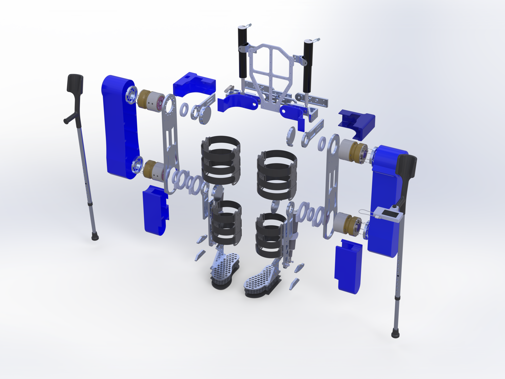
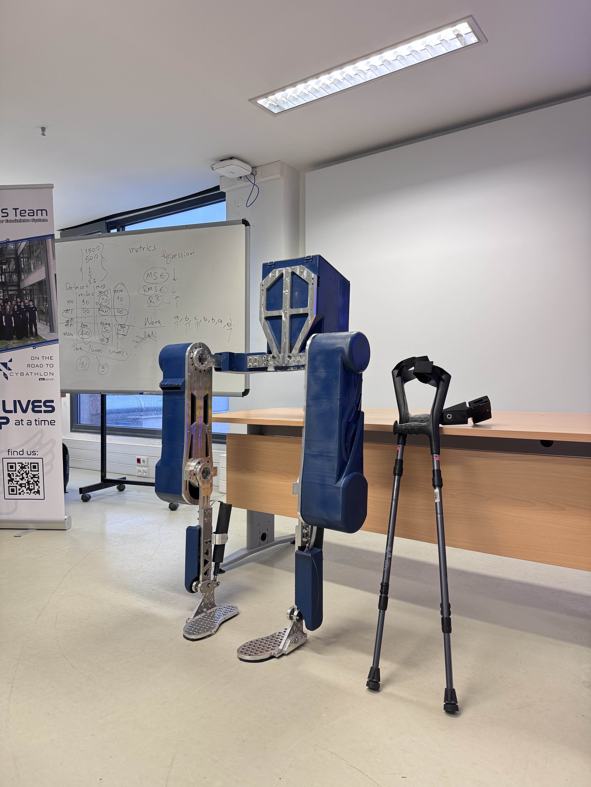
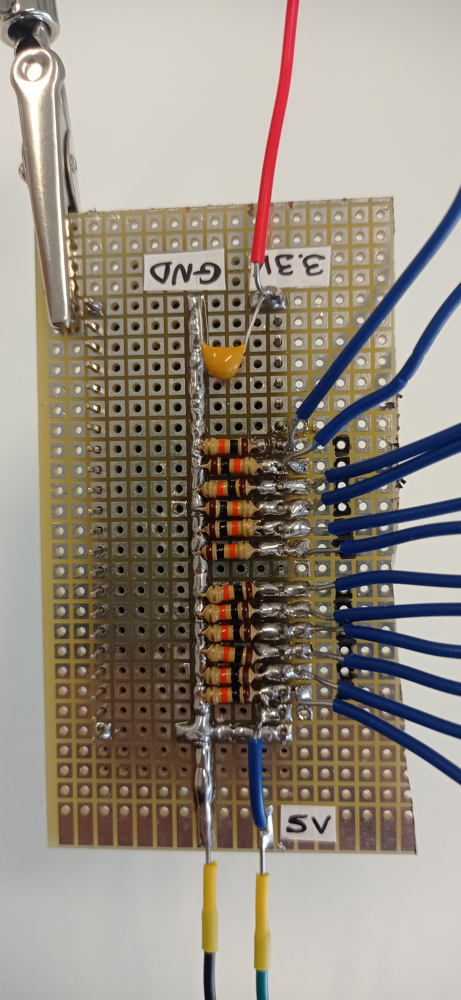
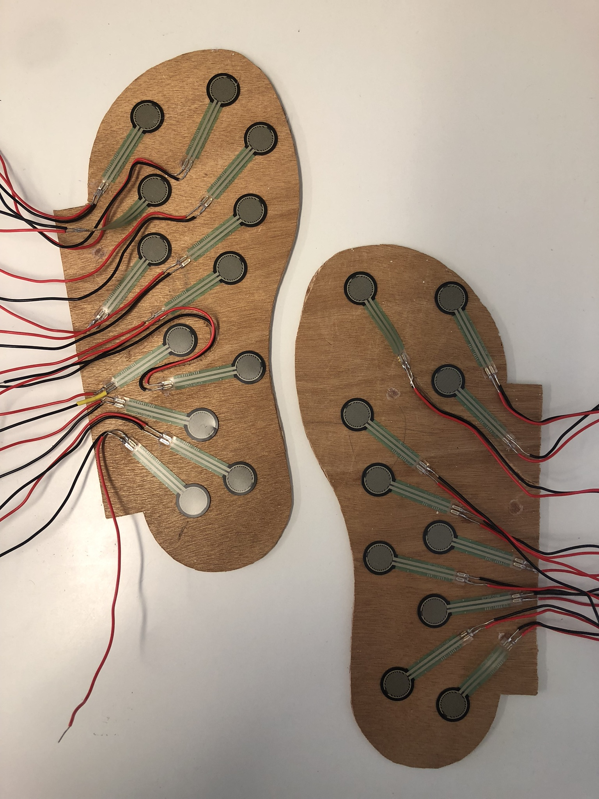
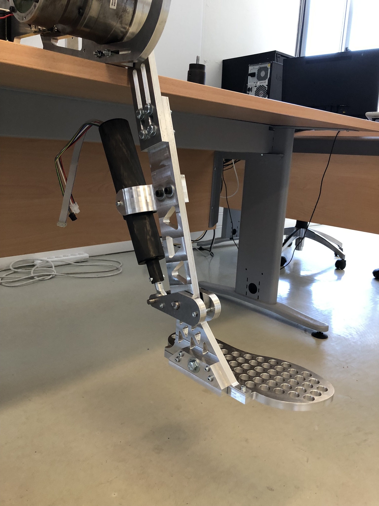
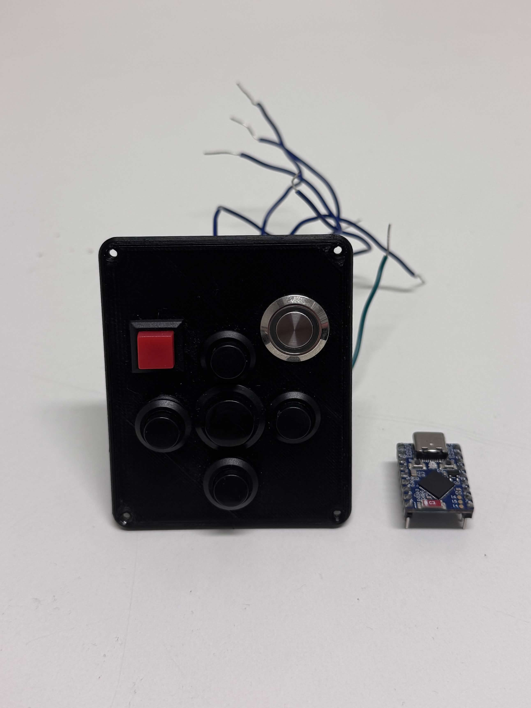
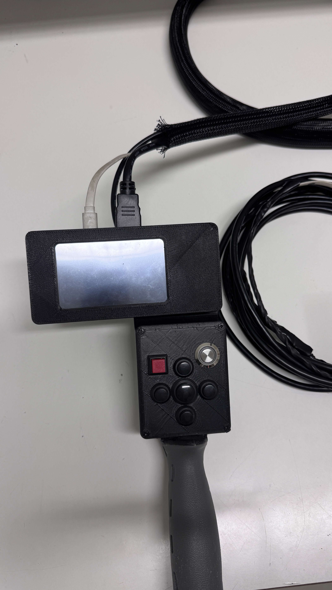
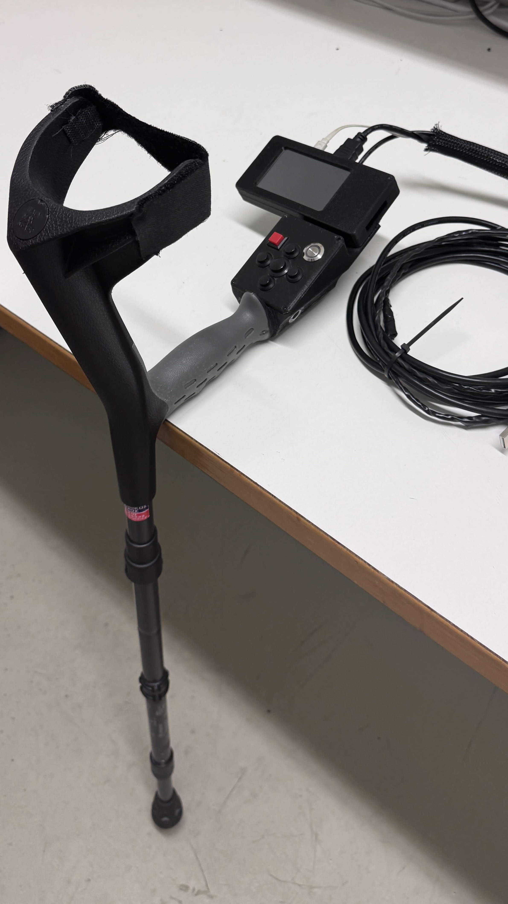
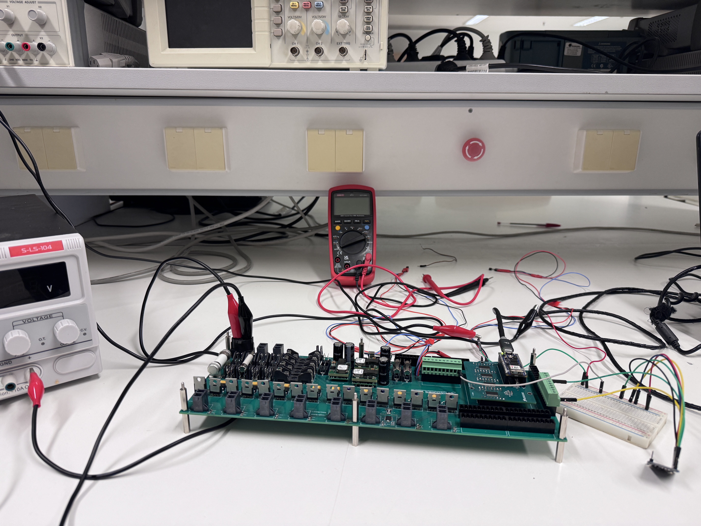
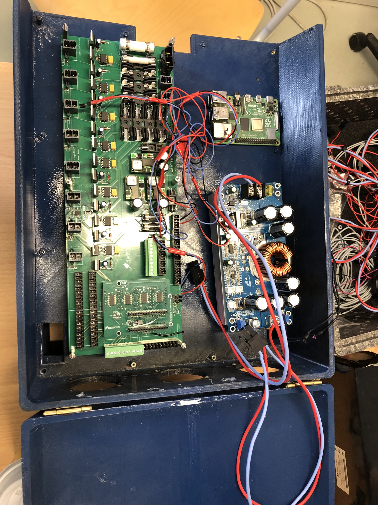

# Contributions to HERMES Exo Project by Stefanos Manos

## Description
This repository showcases the embedded systems I designed and implemented for the HERMES Project in the past year.

## HERMES Exo
A Lower Limb Exoskeleton for people with walking disabilities was assembled. It utilizes electronic motors to substitute human joints.

Images of the system's CAD Design and final Assembly are presented:





A collection of sensor arrangements, utilized by Microcontrollers, is presented.
Each Microcontroller is connected via UART to a Central Processing Unit (Raspberry Pi 4). This Controller collects all data (as .json files) and manages the exoskeleton's movements.

## Low Cost Foot Pressure Sensor
I played a key role in the development of a low-cost foot pressure sensor, using "FSR-420" Sensors distributed in the soles of the exoskeleton.
I took on designing the interface between the "Waveshare RP2350-Zero" Microcontroller and the Sensors.

The custom built sole is presented:

<p align="center">
  
  
  
</p>

Snippets of C++ Code, running on the Microcontrollers, performing the Interpolation and Communication, are presented:

```text
  //Cycle through each Sensor and perform Mapping
  for(i = 0; i < PIN_NUMBER; i++) {
    voltage[i] = analogRead(fsrInput[i]) * (3.3 / 4095.0); 

    //Linear Interpolation
    if(voltage[i] <= 2.8) {
      value[i] = 0;
    }
    else if((voltage[i] > 2.8) && (voltage[i] < 3)) {
      value[i] = 0.5 * (voltage[i] - 2.8) * 10 + 1;
    }
    else if((voltage[i] >= 3) && (voltage[i] <= 3.3)) {
      value[i] = 2.66 * (voltage[i] - 3) * 10 + 2;
    }
    else {
      value[i] = -1;
    }
  }
//Further references available upon request
```

Mapping was performed according to the data provided by the datasheet.


## Multi-Button Controller
I designed an arrangement of push-buttons for user input, located in the right crutch of the Exoskeleton.
I was a major contributor to input and communication implementation using the "Waveshare ESP32-S3" Microcontroller.

The custom built controller is presented:

<p align="center">
  
  
  
</p>

Snippets of C++ Code, running on the # Contributions to HERMES Exo Project by Stefanos Manos

## Description
This repository showcases the embedded systems I designed and implemented for the HERMES Project in the past year.

## HERMES Exo
A Lower Limb Exoskeleton for people with walking disabilities was assembled. It utilizes electronic motors, to substitute human joints.

Images of the system's CAD Design and final Assembly are presented:


A collection of sensor arrangements, utilized by Microcontrollers, is presented.
Each Microcontroller is connected via UART to a Central Processing Unit (Raspberry Pi 4). This Controller collects all data (as .json files) and manages the exoskeleton's movements.

## Low Cost Foot Pressure Sensor
I played a key role in the development of a low-cost foot pressure sensor, using "FSR-420" Sensors distributed in the soles of the exoskeleton.
I took on designing the interface between the "Waveshare RP2350-Zero" Microcontroller and the Sensors.

The custom built sole is presented:

<p align="center">
  
  
  
</p>

Snippets of C++ Code, running on the Microcontrollers, performing the Interpolation and Communication, are presented:

```text
  //Cycle through each Sensor and perform Mapping
  for(i = 0; i < PIN_NUMBER; i++) {
    voltage[i] = analogRead(fsrInput[i]) * (3.3 / 4095.0); 

    //Linear Interpolation
    if(voltage[i] <= 2.8) {
      value[i] = 0;
    }
    else if((voltage[i] > 2.8) && (voltage[i] < 3)) {
      value[i] = 0.5 * (voltage[i] - 2.8) * 10 + 1;
    }
    else if((voltage[i] >= 3) && (voltage[i] <= 3.3)) {
      value[i] = 2.66 * (voltage[i] - 3) * 10 + 2;
    }
    else {
      value[i] = -1;
    }
  }
//Further references available upon request
```

Mapping was performed according to the data provided by the datasheet.


## Multi-Button Controller
I designed an arrangement of push-buttons for user input, located in the right crutch of the Exoskeleton.
I was a major contributor to input and communication implementation using the "Waveshare ESP32-S3" Microcontroller.

The custom built controller is presented:

<p align="center">
  
  
  
</p>

Snippets of C++ Code, running on the # Contributions to HERMES Exo Project by Stefanos Manos

## Description
This repository showcases the embedded systems I designed and implemented for the HERMES Project in the past year.

## HERMES Exo
A Lower Limb Exoskeleton for people with walking disabilities was assembled. It utilizes electronic motors, to substitute human joints.

Images of the system's CAD Design and final Assembly are presented:


A collection of sensor arrangements, utilized by Microcontrollers, is presented.
Each Microcontroller is connected via UART to a Central Processing Unit (Raspberry Pi 4). This Controller collects all data (as .json files) and manages the exoskeleton's movements.

## Low Cost Foot Pressure Sensor
I played a key role in the development of a low-cost foot pressure sensor, using "FSR-420" Sensors distributed in the soles of the exoskeleton.
I took on designing the interface between the "Waveshare RP2350-Zero" Microcontroller and the Sensors.

The custom built sole is presented:

<p align="center">
  
  
  
</p>

Snippets of C++ Code, running on the Microcontrollers, performing the Interpolation and Communication, are presented:

```text
  //Cycle through each Sensor and perform Mapping
  for(i = 0; i < PIN_NUMBER; i++) {
    voltage[i] = analogRead(fsrInput[i]) * (3.3 / 4095.0); 

    //Linear Interpolation
    if(voltage[i] <= 2.8) {
      value[i] = 0;
    }
    else if((voltage[i] > 2.8) && (voltage[i] < 3)) {
      value[i] = 0.5 * (voltage[i] - 2.8) * 10 + 1;
    }
    else if((voltage[i] >= 3) && (voltage[i] <= 3.3)) {
      value[i] = 2.66 * (voltage[i] - 3) * 10 + 2;
    }
    else {
      value[i] = -1;
    }
  }
//Further references available upon request
```

Mapping was performed according to the data provided by the datasheet.


## Multi-Button Controller
I designed an arrangement of push-buttons for user input, located in the right crutch of the Exoskeleton.
I was a major contributor to input and communication implementation using the "Waveshare ESP32-S3" Microcontroller.

The custom built controller is presented:

<p align="center">
  
  
  
</p>

Snippets of C++ Code, running on the Micrcontrollers, performing Debouncing and Communication, are presented:

```text
int readButton()
{
    for (i = 0; i < buttonNo; i++)
    {
        readingAfter[i] = 0;
    }

    for (i = 0; i < buttonNo; i++)
    {
        readingBefore[i] = digitalRead(buttonPins[i]);
        if ((readingBefore[i] == 1) && (previousButtonPress[i] == 1))
        {
            previousButtonPress[i] = 0;
        }
    }

    for (i = 0; i < waitingTime; i++)
    {
        delay(samplingInterval);

        for (j = 0; j < buttonNo; j++)
        {
            if (readingBefore[j] == 0)
            {
                tmp[j] = digitalRead(buttonPins[j]);

                readingAfter[j] = readingAfter[j] + tmp[j];
            }
        }
    }

    int simultaneousPresses = 0;

    for (i = 0; i < BUTTONS_NO; i++)
    {
        if (previousButtonPress[i] == 1)
        {
            simultaneousPresses++;
        }
    }

    if (simultaneousPresses >= 1)
    {
        // Serial.println("Simultaneous Presses");
        return -1;
    }

    for (i = 0; i < BUTTONS_NO; i++)
    {
        if ((previousButtonPress[i] != 1) && (readingBefore[i] == 0) && (readingAfter[i] == 0))
        {
            previousButtonPress[i] = 1;

            return (i);
        }
    }
    return (-1);
}
//Further references available upon request
```

```text
int main()
{
    std::string port = find_arduino();
    if (port.empty()) {
        std::cout << "No Arduino found with matching serial.\n";
        return 1;
    }

    serial::Serial ser;
    try {
        ser.setPort(port);
        ser.setBaudrate(BAUD_RATE);
        ser.setTimeout(serial::Timeout::simpleTimeout(2000));
        ser.open();
    } catch (std::exception& e) {
        std::cout << "Could not open serial port: " << e.what() << "\n";
        return 1;
    }

    std::cout << "Starting serial listener...\n";
    std::thread listener(listen_serial, &ser, port);
    std::cout << "Running. Press Ctrl+C to exit.\n";

    // Main loop
    while (running) {
        std::this_thread::sleep_for(std::chrono::seconds(1));
    }

    listener.join();
    return 0;
}
//Further references available upon request.
```

## Central Sensor Input System
I played a key role in the development of a sensor interface system built with an "Arduino RP2040" and multiplexing circuits, bypassing the Arduino’s pin limitations.

The system hardware is presented below:
<p align="center">
  
  
</p>

The circuit was implemented on a PCB and interfaces with different sensor types:

1) Inertial Measurement Units (IMUs)
2) Temperature Sensors
3) Voltage Sensors
4) Current Sensors

Microcontrollers perform IMU sensor fusion, voltage Mapping, Error Detection and Communication with the Central Controller.
Code optimization and acceleration was performed through the use of the Dual-Core Processor integrated in the "RP2040".
Sampling rate is estimated to 34 Hz.

Snippets of C++ Code are presented:
```text
//Loop through every Multiplexing and Select Pin Variation
int *sensorInput()
{
    int muxPins = pow(2, selectPinsNum);

    int *results = new int[muxNumber * muxPins]();

    // Go through each select combination first
    for (int count = 0; count < muxPins; count++)
    {
        // Set Selection Pin Voltages ONCE
        for (int j = 0; j < selectPinsNum; j++)
        {
            digitalWrite(selectPins[j], bitRead(count, j));
        }

        delay(2); // Allow signal to stabilize

        // Now read ALL multiplexers for this select state
        for (int i = 0; i < muxNumber; i++)
        {
            // Skip invalid pins in last MUX
            if (i == muxNumber - 1 && count >= lastMuxPinNumber)
            {
                results[count + i * muxPins] = 0;
                continue;
            }

            results[count + i * muxPins] = analogRead(inputPins[i]);
        }
    }

    return results;
}
//Further references available upon request
```

```text
void GyroLoop(float deltat)
{
    // ==========================================================
    //  READ SENSORS
    // ==========================================================
    if (readByte(LSM9DS1XG_ADDRESS, LSM9DS1XG_STATUS_REG) & 0x01)
    {
        readAccelData(accelCount);
        ax = accelCount[0] * aRes;
        ay = accelCount[1] * aRes;
        az = accelCount[2] * aRes;
    }

    if (readByte(LSM9DS1XG_ADDRESS, LSM9DS1XG_STATUS_REG) & 0x02)
    {
        readGyroData(gyroCount);
        gx = gyroCount[0] * gRes - gyroBias[0]; // deg/s
        gy = gyroCount[1] * gRes - gyroBias[1];
        gz = gyroCount[2] * gRes - gyroBias[2];
    }

    if (readByte(LSM9DS1M_ADDRESS, LSM9DS1M_STATUS_REG_M) & 0x08)
    {
        readMagData(magCount);
        mx = magCount[0] * mRes;
        my = magCount[1] * mRes;
        mz = magCount[2] * mRes;
    }

    //
    //
    //

    // ==========================================================
    //  ONLINE GYRO BIAS ADAPTATION
    // ==========================================================
    if (gyroMag < 0.01f && fabs(accelMagRaw - 1.0f) < 0.02f)
    {
        float k = 0.0005f;
        gyroBias[0] += k * gx;
        gyroBias[1] += k * gy;
        gyroBias[2] += k * gz;

        gyroBias[0] = constrain(gyroBias[0], -5.0f, 5.0f);
        gyroBias[1] = constrain(gyroBias[1], -5.0f, 5.0f);
        gyroBias[2] = constrain(gyroBias[2], -5.0f, 5.0f);
    }  
}
//Further references available upon request
```

```text
const int VoltPins_48[VoltNum_48] = {0};
const int VoltPins_36[VoltNum_36] = {0};
const int VoltPins_12[VoltNum_12] = {0};
const int VoltPins_5[VoltNum_5] = {0};
const int VoltPins3_3[VoltNum_3_3] = {0};
const int CurrentPins[CurrentNum] = {0};
const int MoterPins[MoterNum] = {0};

// SetUp Sensors
void initMoter() {}
void initVoltage() {}
void initCurrent() {}

// Self-Tests Funs
bool selftestMoter(int pin) { return true; }
bool selftestVoltage(int pin) { return true; }
bool selftestCurrent(int pin) { return true; }
bool selftestGyro(int sensor_index) { return true; }

// Send self test values using typed table
void checkSelfTests()
{
    // Temperatures
    for (int i = 0; i < TempNum; i++)
    {
        valuesJson["ErrorTemp"][i] = selftestTemprature(i);
    }

    // Volt 48
    for (int i = 0; i < VoltNum_48; i++)
    {
        valuesJson["ErrorVolt48"][i] = selftestVoltage(VoltPins_48[i]);
    }

    // Volt 36
    for (int i = 0; i < VoltNum_36; i++)
    {
        valuesJson["ErrorVolt36"][i] = selftestVoltage(VoltPins_36[i]);
    }

    // Volt 12
    for (int i = 0; i < VoltNum_12; i++)
    {
        valuesJson["ErrorVolt12"][i] = selftestVoltage(VoltPins_12[i]);
    }

    // Volt 5
    for (int i = 0; i < VoltNum_5; i++)
    {
        valuesJson["ErrorVolt5"][i] = selftestVoltage(VoltPins_5[i]);
    }

    // Volt 3.3
    for (int i = 0; i < VoltNum_3_3; i++)
    {
        valuesJson["ErrorVolt3.3"][i] = false;
    }

    // Current
    for (int i = 0; i < CurrentNum; i++)
    {
        valuesJson["ErrorCurr"][i] = selftestCurrent(CurrentPins[i]);
    }

    // Gyro
    if(imuOnline)
    {
        for (int i = 0; i < GyroNum; i++)
        {
            if (internal_gyro_test)
            {
                valuesJson["ErrorGyro"][i] = selftestGyro(i);
            }
            else
            {
                valuesJson["ErrorGyro"][i] = false;
            }
        }
    }

    // Motors
    for (int i = 0; i < MoterNum; i++)
    {
        valuesJson["ErrorMoter"][i] = selftestMoter(MoterPins[i]);
    }
}

// Use read values to set Json
void setValuestoJson()
{
    // Read Moter Values
    for (int i = 0; i < MoterNum; i++)
    {
        valuesJson["Moter"][i] = moter_Array[i];
    }

    // Read Temperature Values
    for (int i = 0; i < TempNum; i++)
    {
        valuesJson["Temp"][i] = temp_Array[i];
    }

    // Read Voltage 48V Values
    for (int i = 0; i < VoltNum_48; i++)
    {
        valuesJson["Volt48"][i] = volt_48_Array[i];
    }

    // Read Voltage 36V Values
    for (int i = 0; i < VoltNum_36; i++)
    {
        valuesJson["Volt36"][i] = volt_36_Array[i];
    }

    // Read Voltage 12V Values
    for (int i = 0; i < VoltNum_12; i++)
    {
        valuesJson["Volt12"][i] = volt_12_Array[i];
    }

    // Read Voltage 5V Values
    for (int i = 0; i < VoltNum_5; i++)
    {
        valuesJson["Volt5"][i] = volt_5_Array[i];
    }

    // Read Voltage 3.3V Values
    for (int i = 0; i < VoltNum_3_3; i++)
    {
        valuesJson["Volt3.3"][i] = volt_3_3_Array[i];
    }

    // Read Current Values
    for (int i = 0; i < CurrentNum; i++)
    {
        valuesJson["Curr"][i] = current_Array[i];
    }

    // Read Gyro/Accel/Mag Values
    if(imuOnline)
    {
        for (int i = 0; i < GyroNum; i++)
        {
            GyroGetQuaternion(GyroAngles[i]);

            for (int j = 0; j < GyroValues; j++)
            {
                valuesJson["Gyro"][i][j] = GyroAngles[i][j];
            }
        }
    }

    delete[] volt_48_Array;
    delete[] volt_36_Array;
    delete[] volt_12_Array;
    delete[] volt_5_Array;
    delete[] volt_3_3_Array;
    delete[] current_Array;
    delete[] moter_Array;
}

void setup()
{
    Serial.begin(115200);
    delay(1000); // small delay to let Serial initialize

    Wire.setClock(400000);

    // Increase ADC Resolution
    analogReadResolution(12);

    // Initialise MUX Selection Pins
    for (int i = 0; i < S_NUM; i++)
    {
        pinMode(selectPins[i], OUTPUT);
    }

    // Initialise MUX Output Pins
    for (int i = 0; i < MUX_NUM; i++)
    {
        pinMode(muxOut[i], INPUT);
    }

    // Read first sensor values
    getSensorsValues();

    // Initialize Sensors
    initTemprature();
    initVoltage();
    initCurrent();
    initMoter();

    GyroSetup(&imuOnline);

    // Self Test Gyro/Accel/Mag (take some time)
    if (imuOnline)
        internal_gyro_test = GyroSelfTest();

    delay(1000); // wait 1 second before starting loop
}

void setup1()
{
    lastIMUTime = micros();
}

void loop()
{
    uint32_t t0 = micros();

    valuesJson.clear();
    getSensorsValues();
    checkSelfTests();
    setValuestoJson();

    uint32_t tSensors = micros();

    serializeJson(valuesJson, Serial);
    Serial.println();

    uint32_t tSerial = micros();

    // Sensors(s): 0.034475  Serial(s): 0.009682  Total(s): 0.044157

    // Sensor + JSON building: ~30-40 ms
    // Serializing and sending over USB: ~8.5-9.5 ms
    // Total for sensors (exept gyro) - serialize: ~45 ms

    // Gyro - in seperate core: 3μs

    // float sensorTime = (tSensors - t0) / 1000000.0f;
    // float serialTime = (tSerial - tSensors) / 1000000.0f;
    // float totalTime = (tSerial - t0) / 1000000.0f;

    // Serial.print("Sensors(s): ");
    // Serial.print(sensorTime, 6);
    // Serial.print("  Serial(s): ");
    // Serial.print(serialTime, 6);
    // Serial.print("  Total(s): ");
    // Serial.println(totalTime, 6);
}

void loop1()
{
    // This loop is for testing timing of gyro integration without any other code running
    uint32_t now = micros();

    if ((uint32_t)(now - lastIMUTime) >= IMU_PERIOD_US)
    {
        lastIMUTime += IMU_PERIOD_US;

        float deltat = 1.0f / IMU_RATE_HZ;

        if (imuOnline)
        {
            GyroLoop(deltat);
        }
    }

    // uint32_t TGyro = micros();

    // float gyroTime = (TGyro - now) / 1000000.0f;

    // Serial.print("Gyro Loop Time (s): ");
    // Serial.println(gyroTime, 6);
}
//Further references available upon request
```

, performing Debouncing and Communication, are presented:

```text
int readButton()
{
    for (i = 0; i < buttonNo; i++)
    {
        readingAfter[i] = 0;
    }

    for (i = 0; i < buttonNo; i++)
    {
        readingBefore[i] = digitalRead(buttonPins[i]);
        if ((readingBefore[i] == 1) && (previousButtonPress[i] == 1))
        {
            previousButtonPress[i] = 0;
        }
    }

    for (i = 0; i < waitingTime; i++)
    {
        delay(samplingInterval);

        for (j = 0; j < buttonNo; j++)
        {
            if (readingBefore[j] == 0)
            {
                tmp[j] = digitalRead(buttonPins[j]);

                readingAfter[j] = readingAfter[j] + tmp[j];
            }
        }
    }

    int simultaneousPresses = 0;

    for (i = 0; i < BUTTONS_NO; i++)
    {
        if (previousButtonPress[i] == 1)
        {
            simultaneousPresses++;
        }
    }

    if (simultaneousPresses >= 1)
    {
        // Serial.println("Simultaneous Presses");
        return -1;
    }

    for (i = 0; i < BUTTONS_NO; i++)
    {
        if ((previousButtonPress[i] != 1) && (readingBefore[i] == 0) && (readingAfter[i] == 0))
        {
            previousButtonPress[i] = 1;

            return (i);
        }
    }
    return (-1);
}
//Further references available upon request
```

```text
int main()
{
    std::string port = find_arduino();
    if (port.empty()) {
        std::cout << "No Arduino found with matching serial.\n";
        return 1;
    }

    serial::Serial ser;
    try {
        ser.setPort(port);
        ser.setBaudrate(BAUD_RATE);
        ser.setTimeout(serial::Timeout::simpleTimeout(2000));
        ser.open();
    } catch (std::exception& e) {
        std::cout << "Could not open serial port: " << e.what() << "\n";
        return 1;
    }

    std::cout << "Starting serial listener...\n";
    std::thread listener(listen_serial, &ser, port);
    std::cout << "Running. Press Ctrl+C to exit.\n";

    // Main loop
    while (running) {
        std::this_thread::sleep_for(std::chrono::seconds(1));
    }

    listener.join();
    return 0;
}
//Further references available upon request.
```

## Central Sensor Input System
I played a key role in the development of a sensor interface system built with an "Arduino RP2040" and multiplexing circuits, bypassing the Arduino’s pin limitations.

The system hardware is presented below:
<p align="center">
  
  
</p>

The circuit was implemented on a PCB and interfaces with different sensor types:

1) Inertial Measurement Units (IMUs)
2) Temperature Sensors
3) Voltage Sensors
4) Current Sensors

Microcontrollers perform IMU sensor fusion, voltage Mapping, error Detection and Communication with the Central Controller.
Code optimization and acceleration was performed through the use of the Dual-Core Processor integrated in the "RP2040".
Sampling rate is estimated to 34Hz.

Snippets of C++ Code are presented:
```text
//Loop through every Multiplexing and Select Pin Variation
int *sensorInput()
{
    int muxPins = pow(2, selectPinsNum);

    int *results = new int[muxNumber * muxPins]();

    // Go through each select combination first
    for (int count = 0; count < muxPins; count++)
    {
        // Set Selection Pin Voltages ONCE
        for (int j = 0; j < selectPinsNum; j++)
        {
            digitalWrite(selectPins[j], bitRead(count, j));
        }

        delay(2); // Allow signal to stabilize

        // Now read ALL multiplexers for this select state
        for (int i = 0; i < muxNumber; i++)
        {
            // Skip invalid pins in last MUX
            if (i == muxNumber - 1 && count >= lastMuxPinNumber)
            {
                results[count + i * muxPins] = 0;
                continue;
            }

            results[count + i * muxPins] = analogRead(inputPins[i]);
        }
    }

    return results;
}
//Further references available upon request
```

```text
void GyroLoop(float deltat)
{
    // ==========================================================
    //  READ SENSORS
    // ==========================================================
    if (readByte(LSM9DS1XG_ADDRESS, LSM9DS1XG_STATUS_REG) & 0x01)
    {
        readAccelData(accelCount);
        ax = accelCount[0] * aRes;
        ay = accelCount[1] * aRes;
        az = accelCount[2] * aRes;
    }

    if (readByte(LSM9DS1XG_ADDRESS, LSM9DS1XG_STATUS_REG) & 0x02)
    {
        readGyroData(gyroCount);
        gx = gyroCount[0] * gRes - gyroBias[0]; // deg/s
        gy = gyroCount[1] * gRes - gyroBias[1];
        gz = gyroCount[2] * gRes - gyroBias[2];
    }

    if (readByte(LSM9DS1M_ADDRESS, LSM9DS1M_STATUS_REG_M) & 0x08)
    {
        readMagData(magCount);
        mx = magCount[0] * mRes;
        my = magCount[1] * mRes;
        mz = magCount[2] * mRes;
    }

    //
    //
    //

    // ==========================================================
    //  ONLINE GYRO BIAS ADAPTATION
    // ==========================================================
    if (gyroMag < 0.01f && fabs(accelMagRaw - 1.0f) < 0.02f)
    {
        float k = 0.0005f;
        gyroBias[0] += k * gx;
        gyroBias[1] += k * gy;
        gyroBias[2] += k * gz;

        gyroBias[0] = constrain(gyroBias[0], -5.0f, 5.0f);
        gyroBias[1] = constrain(gyroBias[1], -5.0f, 5.0f);
        gyroBias[2] = constrain(gyroBias[2], -5.0f, 5.0f);
    }  
}
//Further references available upon request
```

```text
const int VoltPins_48[VoltNum_48] = {0};
const int VoltPins_36[VoltNum_36] = {0};
const int VoltPins_12[VoltNum_12] = {0};
const int VoltPins_5[VoltNum_5] = {0};
const int VoltPins3_3[VoltNum_3_3] = {0};
const int CurrentPins[CurrentNum] = {0};
const int MoterPins[MoterNum] = {0};

// SetUp Sensors
void initMoter() {}
void initVoltage() {}
void initCurrent() {}

// Self-Tests Funs
bool selftestMoter(int pin) { return true; }
bool selftestVoltage(int pin) { return true; }
bool selftestCurrent(int pin) { return true; }
bool selftestGyro(int sensor_index) { return true; }

// Send self test values using typed table
void checkSelfTests()
{
    // Temperatures
    for (int i = 0; i < TempNum; i++)
    {
        valuesJson["ErrorTemp"][i] = selftestTemprature(i);
    }

    // Volt 48
    for (int i = 0; i < VoltNum_48; i++)
    {
        valuesJson["ErrorVolt48"][i] = selftestVoltage(VoltPins_48[i]);
    }

    // Volt 36
    for (int i = 0; i < VoltNum_36; i++)
    {
        valuesJson["ErrorVolt36"][i] = selftestVoltage(VoltPins_36[i]);
    }

    // Volt 12
    for (int i = 0; i < VoltNum_12; i++)
    {
        valuesJson["ErrorVolt12"][i] = selftestVoltage(VoltPins_12[i]);
    }

    // Volt 5
    for (int i = 0; i < VoltNum_5; i++)
    {
        valuesJson["ErrorVolt5"][i] = selftestVoltage(VoltPins_5[i]);
    }

    // Volt 3.3
    for (int i = 0; i < VoltNum_3_3; i++)
    {
        valuesJson["ErrorVolt3.3"][i] = false;
    }

    // Current
    for (int i = 0; i < CurrentNum; i++)
    {
        valuesJson["ErrorCurr"][i] = selftestCurrent(CurrentPins[i]);
    }

    // Gyro
    if(imuOnline)
    {
        for (int i = 0; i < GyroNum; i++)
        {
            if (internal_gyro_test)
            {
                valuesJson["ErrorGyro"][i] = selftestGyro(i);
            }
            else
            {
                valuesJson["ErrorGyro"][i] = false;
            }
        }
    }

    // Motors
    for (int i = 0; i < MoterNum; i++)
    {
        valuesJson["ErrorMoter"][i] = selftestMoter(MoterPins[i]);
    }
}

// Use read values to set Json
void setValuestoJson()
{
    // Read Moter Values
    for (int i = 0; i < MoterNum; i++)
    {
        valuesJson["Moter"][i] = moter_Array[i];
    }

    // Read Temperature Values
    for (int i = 0; i < TempNum; i++)
    {
        valuesJson["Temp"][i] = temp_Array[i];
    }

    // Read Voltage 48V Values
    for (int i = 0; i < VoltNum_48; i++)
    {
        valuesJson["Volt48"][i] = volt_48_Array[i];
    }

    // Read Voltage 36V Values
    for (int i = 0; i < VoltNum_36; i++)
    {
        valuesJson["Volt36"][i] = volt_36_Array[i];
    }

    // Read Voltage 12V Values
    for (int i = 0; i < VoltNum_12; i++)
    {
        valuesJson["Volt12"][i] = volt_12_Array[i];
    }

    // Read Voltage 5V Values
    for (int i = 0; i < VoltNum_5; i++)
    {
        valuesJson["Volt5"][i] = volt_5_Array[i];
    }

    // Read Voltage 3.3V Values
    for (int i = 0; i < VoltNum_3_3; i++)
    {
        valuesJson["Volt3.3"][i] = volt_3_3_Array[i];
    }

    // Read Current Values
    for (int i = 0; i < CurrentNum; i++)
    {
        valuesJson["Curr"][i] = current_Array[i];
    }

    // Read Gyro/Accel/Mag Values
    if(imuOnline)
    {
        for (int i = 0; i < GyroNum; i++)
        {
            GyroGetQuaternion(GyroAngles[i]);

            for (int j = 0; j < GyroValues; j++)
            {
                valuesJson["Gyro"][i][j] = GyroAngles[i][j];
            }
        }
    }

    delete[] volt_48_Array;
    delete[] volt_36_Array;
    delete[] volt_12_Array;
    delete[] volt_5_Array;
    delete[] volt_3_3_Array;
    delete[] current_Array;
    delete[] moter_Array;
}

void setup()
{
    Serial.begin(115200);
    delay(1000); // small delay to let Serial initialize

    Wire.setClock(400000);

    // Increase ADC Resolution
    analogReadResolution(12);

    // Initialise MUX Selection Pins
    for (int i = 0; i < S_NUM; i++)
    {
        pinMode(selectPins[i], OUTPUT);
    }

    // Initialise MUX Output Pins
    for (int i = 0; i < MUX_NUM; i++)
    {
        pinMode(muxOut[i], INPUT);
    }

    // Read first sensor values
    getSensorsValues();

    // Initialize Sensors
    initTemprature();
    initVoltage();
    initCurrent();
    initMoter();

    GyroSetup(&imuOnline);

    // Self Test Gyro/Accel/Mag (take some time)
    if (imuOnline)
        internal_gyro_test = GyroSelfTest();

    delay(1000); // wait 1 second before starting loop
}

void setup1()
{
    lastIMUTime = micros();
}

void loop()
{
    uint32_t t0 = micros();

    valuesJson.clear();
    getSensorsValues();
    checkSelfTests();
    setValuestoJson();

    uint32_t tSensors = micros();

    serializeJson(valuesJson, Serial);
    Serial.println();

    uint32_t tSerial = micros();

    // Sensors(s): 0.034475  Serial(s): 0.009682  Total(s): 0.044157

    // Sensor + JSON building: ~30-40 ms
    // Serializing and sending over USB: ~8.5-9.5 ms
    // Total for sensors (exept gyro) - serialize: ~45 ms

    // Gyro - in seperate core: 3μs

    // float sensorTime = (tSensors - t0) / 1000000.0f;
    // float serialTime = (tSerial - tSensors) / 1000000.0f;
    // float totalTime = (tSerial - t0) / 1000000.0f;

    // Serial.print("Sensors(s): ");
    // Serial.print(sensorTime, 6);
    // Serial.print("  Serial(s): ");
    // Serial.print(serialTime, 6);
    // Serial.print("  Total(s): ");
    // Serial.println(totalTime, 6);
}

void loop1()
{
    // This loop is for testing timing of gyro integration without any other code running
    uint32_t now = micros();

    if ((uint32_t)(now - lastIMUTime) >= IMU_PERIOD_US)
    {
        lastIMUTime += IMU_PERIOD_US;

        float deltat = 1.0f / IMU_RATE_HZ;

        if (imuOnline)
        {
            GyroLoop(deltat);
        }
    }

    // uint32_t TGyro = micros();

    // float gyroTime = (TGyro - now) / 1000000.0f;

    // Serial.print("Gyro Loop Time (s): ");
    // Serial.println(gyroTime, 6);
}
//Further references avaialbe upon request
```

, performing Debouncing and Communication, are presented:

```text
int readButton()
{
    for (i = 0; i < buttonNo; i++)
    {
        readingAfter[i] = 0;
    }

    for (i = 0; i < buttonNo; i++)
    {
        readingBefore[i] = digitalRead(buttonPins[i]);
        if ((readingBefore[i] == 1) && (previousButtonPress[i] == 1))
        {
            previousButtonPress[i] = 0;
        }
    }

    for (i = 0; i < waitingTime; i++)
    {
        delay(samplingInterval);

        for (j = 0; j < buttonNo; j++)
        {
            if (readingBefore[j] == 0)
            {
                tmp[j] = digitalRead(buttonPins[j]);

                readingAfter[j] = readingAfter[j] + tmp[j];
            }
        }
    }

    int simultaneousPresses = 0;

    for (i = 0; i < BUTTONS_NO; i++)
    {
        if (previousButtonPress[i] == 1)
        {
            simultaneousPresses++;
        }
    }

    if (simultaneousPresses >= 1)
    {
        // Serial.println("Simultaneous Presses");
        return -1;
    }

    for (i = 0; i < BUTTONS_NO; i++)
    {
        if ((previousButtonPress[i] != 1) && (readingBefore[i] == 0) && (readingAfter[i] == 0))
        {
            previousButtonPress[i] = 1;

            return (i);
        }
    }
    return (-1);
}
//Further references available upon request
```

```text
int main()
{
    std::string port = find_arduino();
    if (port.empty()) {
        std::cout << "No Arduino found with matching serial.\n";
        return 1;
    }

    serial::Serial ser;
    try {
        ser.setPort(port);
        ser.setBaudrate(BAUD_RATE);
        ser.setTimeout(serial::Timeout::simpleTimeout(2000));
        ser.open();
    } catch (std::exception& e) {
        std::cout << "Could not open serial port: " << e.what() << "\n";
        return 1;
    }

    std::cout << "Starting serial listener...\n";
    std::thread listener(listen_serial, &ser, port);
    std::cout << "Running. Press Ctrl+C to exit.\n";

    // Main loop
    while (running) {
        std::this_thread::sleep_for(std::chrono::seconds(1));
    }

    listener.join();
    return 0;
}
//Further references available upon request.
```

## Central Sensor Input System
I played a key role in the development of a sensor interface system built with an "Arduino RP2040" and multiplexing circuits, bypassing the Arduino’s pin limitations.

The system hardware is presented below:
<p align="center">
  
  
</p>

The circuit was implemented on a PCB and interfaces with different sensor types:

1) Inertial Measurement Units (IMUs)
2) Temperature Sensors
3) Voltage Sensors
4) Current Sensors

Microcontrollers perform IMU sensor fusion, voltage Mapping, error Detection and Communication with the Central Controller.
Code optimization and acceleration was performed through the use of the Dual-Core Processor integrated in the "RP2040".
Sampling rate is estimated to 34Hz.

Snippets of C++ Code are presented:
```text
//Loop through every Multiplexing and Select Pin Variation
int *sensorInput()
{
    int muxPins = pow(2, selectPinsNum);

    int *results = new int[muxNumber * muxPins]();

    // Go through each select combination first
    for (int count = 0; count < muxPins; count++)
    {
        // Set Selection Pin Voltages ONCE
        for (int j = 0; j < selectPinsNum; j++)
        {
            digitalWrite(selectPins[j], bitRead(count, j));
        }

        delay(2); // Allow signal to stabilize

        // Now read ALL multiplexers for this select state
        for (int i = 0; i < muxNumber; i++)
        {
            // Skip invalid pins in last MUX
            if (i == muxNumber - 1 && count >= lastMuxPinNumber)
            {
                results[count + i * muxPins] = 0;
                continue;
            }

            results[count + i * muxPins] = analogRead(inputPins[i]);
        }
    }

    return results;
}
//Further references available upon request
```

```text
void GyroLoop(float deltat)
{
    // ==========================================================
    //  READ SENSORS
    // ==========================================================
    if (readByte(LSM9DS1XG_ADDRESS, LSM9DS1XG_STATUS_REG) & 0x01)
    {
        readAccelData(accelCount);
        ax = accelCount[0] * aRes;
        ay = accelCount[1] * aRes;
        az = accelCount[2] * aRes;
    }

    if (readByte(LSM9DS1XG_ADDRESS, LSM9DS1XG_STATUS_REG) & 0x02)
    {
        readGyroData(gyroCount);
        gx = gyroCount[0] * gRes - gyroBias[0]; // deg/s
        gy = gyroCount[1] * gRes - gyroBias[1];
        gz = gyroCount[2] * gRes - gyroBias[2];
    }

    if (readByte(LSM9DS1M_ADDRESS, LSM9DS1M_STATUS_REG_M) & 0x08)
    {
        readMagData(magCount);
        mx = magCount[0] * mRes;
        my = magCount[1] * mRes;
        mz = magCount[2] * mRes;
    }

    //
    //
    //

    // ==========================================================
    //  ONLINE GYRO BIAS ADAPTATION
    // ==========================================================
    if (gyroMag < 0.01f && fabs(accelMagRaw - 1.0f) < 0.02f)
    {
        float k = 0.0005f;
        gyroBias[0] += k * gx;
        gyroBias[1] += k * gy;
        gyroBias[2] += k * gz;

        gyroBias[0] = constrain(gyroBias[0], -5.0f, 5.0f);
        gyroBias[1] = constrain(gyroBias[1], -5.0f, 5.0f);
        gyroBias[2] = constrain(gyroBias[2], -5.0f, 5.0f);
    }  
}
//Further references available upon request
```

```text
const int VoltPins_48[VoltNum_48] = {0};
const int VoltPins_36[VoltNum_36] = {0};
const int VoltPins_12[VoltNum_12] = {0};
const int VoltPins_5[VoltNum_5] = {0};
const int VoltPins3_3[VoltNum_3_3] = {0};
const int CurrentPins[CurrentNum] = {0};
const int MoterPins[MoterNum] = {0};

// SetUp Sensors
void initMoter() {}
void initVoltage() {}
void initCurrent() {}

// Self-Tests Funs
bool selftestMoter(int pin) { return true; }
bool selftestVoltage(int pin) { return true; }
bool selftestCurrent(int pin) { return true; }
bool selftestGyro(int sensor_index) { return true; }

// Send self test values using typed table
void checkSelfTests()
{
    // Temperatures
    for (int i = 0; i < TempNum; i++)
    {
        valuesJson["ErrorTemp"][i] = selftestTemprature(i);
    }

    // Volt 48
    for (int i = 0; i < VoltNum_48; i++)
    {
        valuesJson["ErrorVolt48"][i] = selftestVoltage(VoltPins_48[i]);
    }

    // Volt 36
    for (int i = 0; i < VoltNum_36; i++)
    {
        valuesJson["ErrorVolt36"][i] = selftestVoltage(VoltPins_36[i]);
    }

    // Volt 12
    for (int i = 0; i < VoltNum_12; i++)
    {
        valuesJson["ErrorVolt12"][i] = selftestVoltage(VoltPins_12[i]);
    }

    // Volt 5
    for (int i = 0; i < VoltNum_5; i++)
    {
        valuesJson["ErrorVolt5"][i] = selftestVoltage(VoltPins_5[i]);
    }

    // Volt 3.3
    for (int i = 0; i < VoltNum_3_3; i++)
    {
        valuesJson["ErrorVolt3.3"][i] = false;
    }

    // Current
    for (int i = 0; i < CurrentNum; i++)
    {
        valuesJson["ErrorCurr"][i] = selftestCurrent(CurrentPins[i]);
    }

    // Gyro
    if(imuOnline)
    {
        for (int i = 0; i < GyroNum; i++)
        {
            if (internal_gyro_test)
            {
                valuesJson["ErrorGyro"][i] = selftestGyro(i);
            }
            else
            {
                valuesJson["ErrorGyro"][i] = false;
            }
        }
    }

    // Motors
    for (int i = 0; i < MoterNum; i++)
    {
        valuesJson["ErrorMoter"][i] = selftestMoter(MoterPins[i]);
    }
}

// Use read values to set Json
void setValuestoJson()
{
    // Read Moter Values
    for (int i = 0; i < MoterNum; i++)
    {
        valuesJson["Moter"][i] = moter_Array[i];
    }

    // Read Temperature Values
    for (int i = 0; i < TempNum; i++)
    {
        valuesJson["Temp"][i] = temp_Array[i];
    }

    // Read Voltage 48V Values
    for (int i = 0; i < VoltNum_48; i++)
    {
        valuesJson["Volt48"][i] = volt_48_Array[i];
    }

    // Read Voltage 36V Values
    for (int i = 0; i < VoltNum_36; i++)
    {
        valuesJson["Volt36"][i] = volt_36_Array[i];
    }

    // Read Voltage 12V Values
    for (int i = 0; i < VoltNum_12; i++)
    {
        valuesJson["Volt12"][i] = volt_12_Array[i];
    }

    // Read Voltage 5V Values
    for (int i = 0; i < VoltNum_5; i++)
    {
        valuesJson["Volt5"][i] = volt_5_Array[i];
    }

    // Read Voltage 3.3V Values
    for (int i = 0; i < VoltNum_3_3; i++)
    {
        valuesJson["Volt3.3"][i] = volt_3_3_Array[i];
    }

    // Read Current Values
    for (int i = 0; i < CurrentNum; i++)
    {
        valuesJson["Curr"][i] = current_Array[i];
    }

    // Read Gyro/Accel/Mag Values
    if(imuOnline)
    {
        for (int i = 0; i < GyroNum; i++)
        {
            GyroGetQuaternion(GyroAngles[i]);

            for (int j = 0; j < GyroValues; j++)
            {
                valuesJson["Gyro"][i][j] = GyroAngles[i][j];
            }
        }
    }

    delete[] volt_48_Array;
    delete[] volt_36_Array;
    delete[] volt_12_Array;
    delete[] volt_5_Array;
    delete[] volt_3_3_Array;
    delete[] current_Array;
    delete[] moter_Array;
}

void setup()
{
    Serial.begin(115200);
    delay(1000); // small delay to let Serial initialize

    Wire.setClock(400000);

    // Increase ADC Resolution
    analogReadResolution(12);

    // Initialise MUX Selection Pins
    for (int i = 0; i < S_NUM; i++)
    {
        pinMode(selectPins[i], OUTPUT);
    }

    // Initialise MUX Output Pins
    for (int i = 0; i < MUX_NUM; i++)
    {
        pinMode(muxOut[i], INPUT);
    }

    // Read first sensor values
    getSensorsValues();

    // Initialize Sensors
    initTemprature();
    initVoltage();
    initCurrent();
    initMoter();

    GyroSetup(&imuOnline);

    // Self Test Gyro/Accel/Mag (take some time)
    if (imuOnline)
        internal_gyro_test = GyroSelfTest();

    delay(1000); // wait 1 second before starting loop
}

void setup1()
{
    lastIMUTime = micros();
}

void loop()
{
    uint32_t t0 = micros();

    valuesJson.clear();
    getSensorsValues();
    checkSelfTests();
    setValuestoJson();

    uint32_t tSensors = micros();

    serializeJson(valuesJson, Serial);
    Serial.println();

    uint32_t tSerial = micros();

    // Sensors(s): 0.034475  Serial(s): 0.009682  Total(s): 0.044157

    // Sensor + JSON building: ~30-40 ms
    // Serializing and sending over USB: ~8.5-9.5 ms
    // Total for sensors (exept gyro) - serialize: ~45 ms

    // Gyro - in seperate core: 3μs

    // float sensorTime = (tSensors - t0) / 1000000.0f;
    // float serialTime = (tSerial - tSensors) / 1000000.0f;
    // float totalTime = (tSerial - t0) / 1000000.0f;

    // Serial.print("Sensors(s): ");
    // Serial.print(sensorTime, 6);
    // Serial.print("  Serial(s): ");
    // Serial.print(serialTime, 6);
    // Serial.print("  Total(s): ");
    // Serial.println(totalTime, 6);
}

void loop1()
{
    // This loop is for testing timing of gyro integration without any other code running
    uint32_t now = micros();

    if ((uint32_t)(now - lastIMUTime) >= IMU_PERIOD_US)
    {
        lastIMUTime += IMU_PERIOD_US;

        float deltat = 1.0f / IMU_RATE_HZ;

        if (imuOnline)
        {
            GyroLoop(deltat);
        }
    }

    // uint32_t TGyro = micros();

    // float gyroTime = (TGyro - now) / 1000000.0f;

    // Serial.print("Gyro Loop Time (s): ");
    // Serial.println(gyroTime, 6);
}
//Further references avaialbe upon request
```